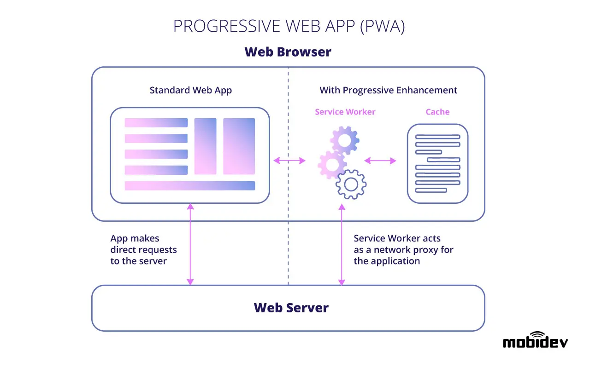

# Lesson 19: SPA, SSR, SSG

## Traditional

Each time new data is needed for the browser view, a request is sent to the server, which returns a new set of page
files. For a static website, this approach is generally fine, but web applications that require faster and more
complicated interaction sometimes struggle to keep up.

### Pros

- Extendable
- Better SEO

### Cons

- Need page reload
- Harder to maintain or update

## SPA

The rise of SPAs has led to a new era for web development. They render when the client requests them, and they are
structured as a single HTML page with no preloaded content.

It means some elements will load-on-demand, so you do not need to worry about your users being stuck on a sluggish
website. With the technology, you can make the user experience seamless and quick as they navigate across a SPA.

### Pros

- The approach is excellent to create dynamic user experiences and a custom feel.
- With an SPA, you do not need to use extra queries to the server for downloading pages.
- It is the perfect choice for creating apps with a rich user interface and delightful features.
- An SPA gives control over the architecture and allows the use of modern web frameworks.
- The initial loading of the application may take time. However, additional loading is not required once it is fully
  loaded.
- It simplifies mobile development, and you can reuse the same backend for building both web and native mobile apps.

### Cons

- Maintaining large files for complex web applications is challenging.
- SEO is challenging due to the lack of initial content on the HTML and its load time.
- Memory leaks in JavaScript are common, and that can cause a powerful application to slow down.
- The SPA approach requires workarounds, which can be very costly and time-consuming.
- The initial load time may suffer as the application grows in size and complexity, adversely impacting the user
  experience.

## SSR

SSR is a significant breakthrough in web development technology that enables developers to provide dynamic content
experiences. SSR is ideal for making personalized sites where live changes can be viewed and applied immediately,
without the need to wait several seconds before any updates happen or being stuck with old information.

SSR is a type of web design in which content for each page must be pre-fetched from an external source and then rendered
onto the server before being sent to the browser. The only flipside is that loading everything in real-time makes the
application slower.

However, SSR ensures that any changes on the site are available immediately and in full detail without taking down the
application for maintenance. The retrieved data can reside on demand to speed up the website through caching services
such as Asset Pipe (a service that caches images) or even HTML5's localStorage object.

### Pros

- Clients do not control page loading time and quality.
- SSR sites rank well for SEO as they offer personalization capabilities.
- Instant display of changed content eliminates the need to rebuild the website each time.
- There are available contents for crawling the data on a search engine. No more empty <body> tags to deal with.
- SSR enables creating personalized experiences through dynamic content and does not require labor-intensive
  workarounds.

### Cons

- The cost of SSR servers is high.
- Content rendering in SSR is slower than the other two approaches.
- API calls to the server are more than those with SPAs and SSGs.

## SSG

SSGs work differently compared to SPA. They help create static sites as they generate content when building new pages or
updating content. SSGs do not depend on user requests and offer consistent content for users.

SSGs work well with a headless CMS, a CDN, and a static hosting site. Webhooks trigger content changes and SSGs deploy
the changes to the site stored in a cache.

### Pros

- Pre-rendered and static content helps improve page loading speed.
- You can easily create multiple content sources and decoupled architecture.
- SEO-friendly and customization capabilities are unrestricted by any templates.
- SSGs promote the organic growth of the project as the infrastructure is easily scalable.
- Developers can create any template they want as they are not limited by fields provided by a CMS.
- Static websites are lightweight and do not need extensive coding to perform on the server-side.

### Cons

- The site must be rebuilt to reflect content changes.
- It is harder for a non-developer to publish content using an SSG.
- The technology does not work well with dynamic content where personalization is paramount.
- Many SSGs do not come with templates, so the developers may have to spend a lot of time designing them from scratch.

## PWA

SPA on steroids

## Compare

